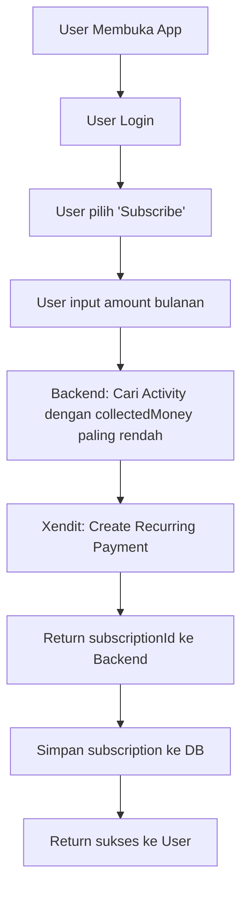
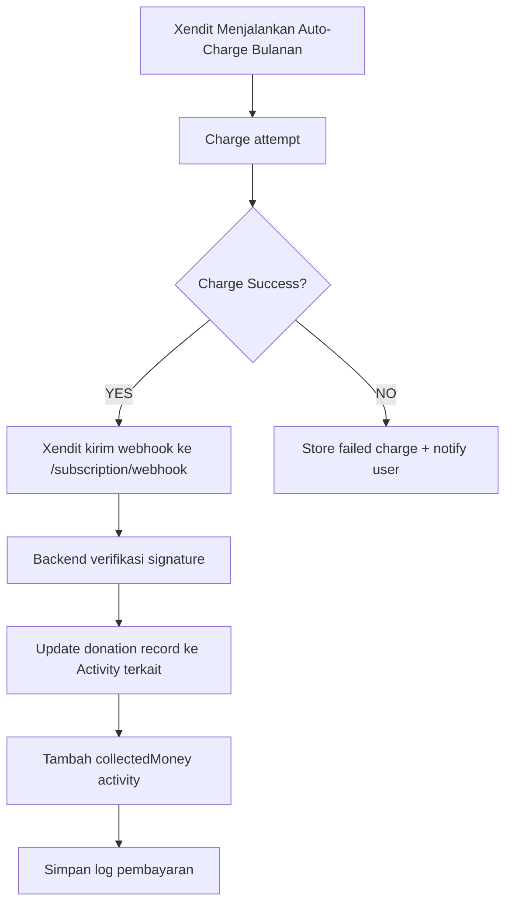
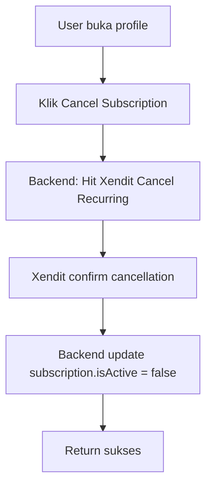
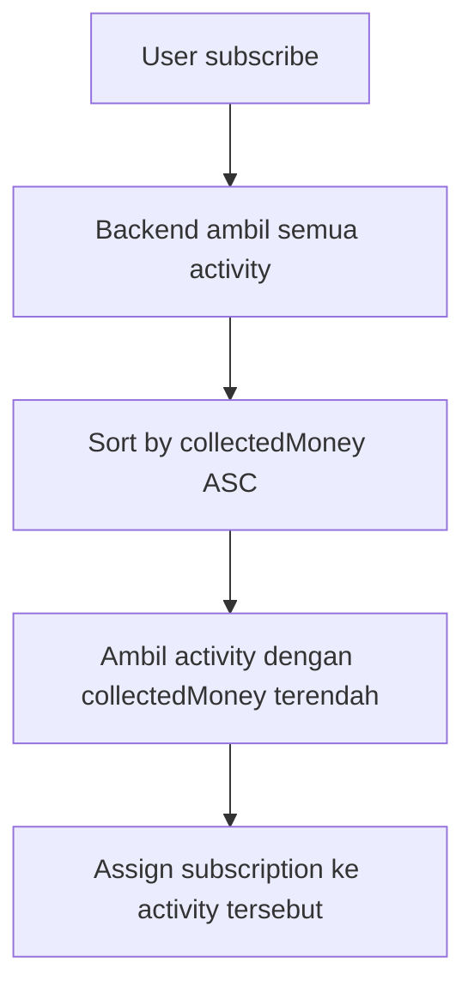
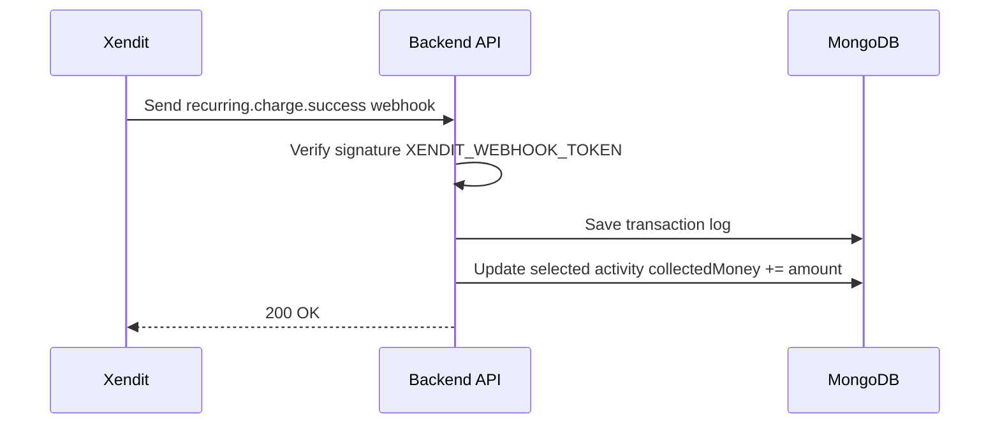

# Subscription Flow Diagram (CareConnect)

## Overview
Dokumentasi ini menjelaskan alur lengkap fitur Subscription pada CareConnect, termasuk:
- User subscribe
- Sistem menentukan activity dengan collectedMoney terendah
- Auto-charge bulanan via Xendit
- Webhook penerimaan dana
- Update distribusi donasi

---

## 1. User Subscribe Flow

---

## 2. Auto-Charge Monthly Flow (Xendit Recurring)

---

## 3. Cancel Subscription Flow

---

## 4. Distribution Logic (Activity Dengan Dana Terkumpul Terendah)

---

## 5. Webhook Flow Detail

---

## 6. Data Model Interaksi

### Collections yang terlibat:
- `users`
- `subscriptions`
- `activities`
- `donations`
- `payment_logs`

---

## End of Flow
